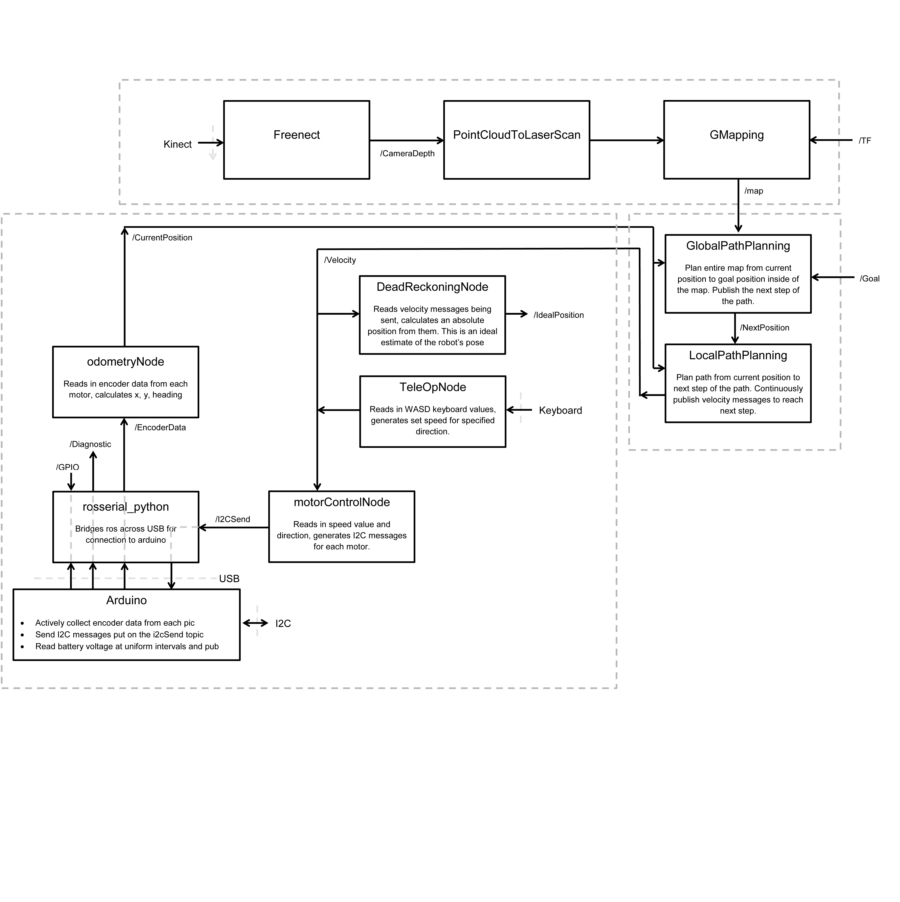

#Welcome to the home of GCRobotics

We are a team of 6 engineers from Geneva College working to create an autonomous robot from scratch. This platform will eventually be entered in the Trinity College RoboWaiter competition. See below for more information on our goals, as well as an overview of our repository organization.

##Goals

The goal of the GCRobotics team is to start the process of building a fully autonomous robotics platform that can be used primarily in the Trinity College Robowaiter competition, but also to design with the ability to take the platform to other new and exciting competitions.

##Code Overview

Low level motor control is currently being done on 4 seperate PIC16F877 microcontrollers. These controllers are responsible for PID control of the motors and use I2C to pass messages to a central computer. These messages are passed to an arduino which acts as the I2C master. This arduino connects over USB to the FitPC, an intel atom based single board computer. All code on the FitPC is integrated with ROS, allowing us to easily add/remove/manipulate pieces as we see fit.

All code pertaining to the PIC microcontrollers can be found in the "PIC Code" folder. All code here was written with MPLab X, using the HiTech C compiler. All code pertaining to the FitPC is in the GCRobotics folder. This is the root of our ROS package, from there all code is organized in keeping with normal ROS standards (src for source code, msg for custom messages...) Each node has a seperate folder in the src folder pertaining to the node name. 

#Overview of ROS Package

The GCRobotics folder is the root of our ros package. on the FitPC, this package has been added to the ROS_PACKAGE_ROS variable allowing it to be immediately accessible. 

Code for each node can be found in the src folder, each node having a folder of the same name. 

All custom messages are placed in the msg folder, and are compiled when using rosmake.

Take a look at our software framework diagram to see how each node communicates over which topics.

Finally, the GCRobotics.launch file will start all code for the kinect, mapping, navigation, and motor control.

